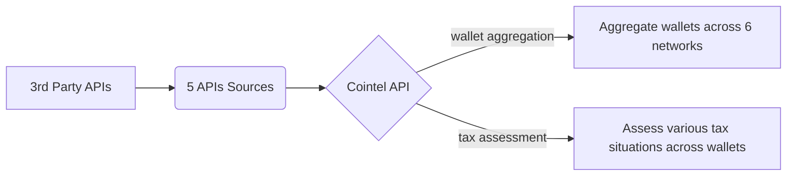

# Cointel's API on Heroku!

Check it Out! https://cointel-api.herokuapp.com/__docs__/

```mermaid
flowchart LR
A[3rd Party APIs] --> B(5 APIs Sources)
B --> C{Cointel API}
C -->|wallet aggregation| D[Aggregate wallets across 6 networks]
C -->|tax assessment| E[Assess various tax situations across wallets]
```
